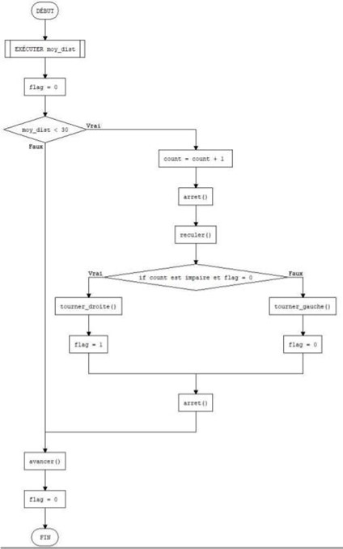
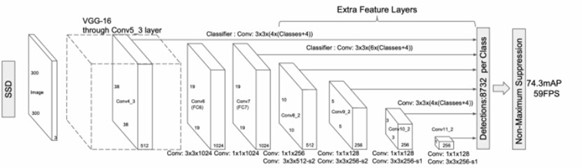
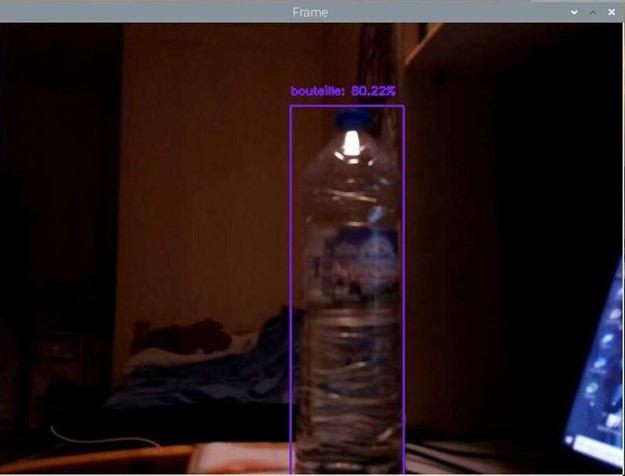

# Projet-Robot-Car

_A l’occasion de ce projet, j’ai continué ce projet que j’ai effectué l’année dernière pour améliorer les différentes fonctionnalités du robot._
En effet, l’objectif est de piloter le robot sans besoin d’interaction humaine grâce à un capteur d’ultrason et d’utiliser une caméra pour effectuer de la reconnaissance d’objet. Ce robot va permet de détecter les différents objets s’il est réellement dangereux pour intervenir dans la surveillance ou dans la sécurité routière par exemple.

_Le robot est composé finalement 🇦🇽

-4 moteurs à courant continu fixé à 4 roues

-4 modules à relais sur 5V

-Deux plaques pour fixer les composants électroniques

-Un Raspberry Pi 4 modèle B

-Une batterie 5V/4A + une pile d’alimentation  

-Un régulateur de tension contenant à un condensateur de découplage et d’un interrupteur électronique._

-Un module d’une caméra du type NOIR v2

-Un Micro SD

-Un capteur d’ultrason du type HC-SR04

__Dans notre Raspberry Pi, j’ai utilisé dans une machine Linux (système d’exploitation Raspbian)  qui va connecter à distance en réseau local l’environnement du bureau grâce au logiciel VNC Server.__ 

__Nous avons décidé d’enlever l’interface graphique et de remplacer par un nouveau script en Python pour rendre très autonome le robot. Plus précisément, le robot va automatiquement détecter les différents obstacles qui se trouve à la face avant du robot et d’identifier les objets en utilisant de la reconnaissance d’objet.
Pour que le robot soit autonome, il faudrait que le robot soit capable d’exécuter en boucle infini à plusieurs temps d’arrêt pour qui arrive à se retrouver sa vraie position du robot. Une fois qui retrouve sa position, le robot doit être capable de chercher le chemin où il souhaite d’aller.__ 

# Algorithme pour la détection des obstacles 

Il audrait que notre robot soit capable de rencontrer les obstacles à l’infini. Pour cela on doit définir une boucle « while True » ce qui permet de récupérer toutes les valeurs de distances et puis on compare toutes les valeurs de distance si le robot est capable de rencontrer plus ou moins proche un obstacle.
Dans l’algorithme défini ci-dessous, pour que le robot soit capable de rencontrer un obstacle, on fixe une distance minimum à 30 et si sa distance est inférieure à 30, le compteur s’incrémente et le robot forcera à l’arrêt et au recul et au bout d’une seconde le robot va soit tourner à droite ou à gauche. Si non le robot continuera à avancer jusqu’à qui rencontre un obstacle.

#Détection de l’objet : Single Shot Multibox Detector

Le Single Shot Multibox detector est un Framework qui va permettre d’effectuer la détection d’objet en détectant plusieurs objets dans un seul image. Il est basé par un réseau convolutif pour produire une collection de taille fixe de cadres de délimitions et de scores pour la présence d’instances de classe d’objets dans ces cadres.

Nous avons utilisé notre Raspberry pour implémenter notre module de caméra pour faire la
reconnaissance d’objet. Il faudrait utiliser la librairie de OpenCV pour gérer des calculs de
traitement d’images.
Notre projet de reconnaissance d’objet contient trois fichiers :
-Le programme python appelé : reconnaissance_objets.py représente notre algorithme qui effectuera la classification des images et la détection des objets.
-Le fichier MobileNetSSD_deploy.caffemodel contenant la liste des 21 types d’objets
-Le fichier de configuration : MobileNetSSD_deploy.prototxt qui servira à déployer les données dans le MobileNetSSD

L’image qui a réussi à prédire la bouteille 

